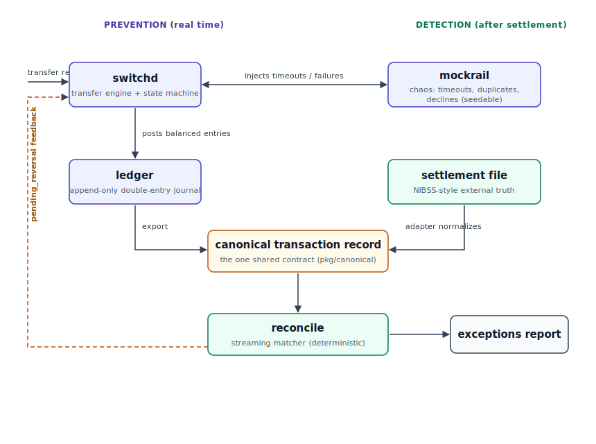

# Invariant Core + Reconcile

A simulated instant-payments transfer engine and strictly-consistent double-entry ledger, paired with a reconciliation CLI that proves — after settlement — that what the system *thinks* happened matches what *actually* settled.

This is a portfolio-grade systems project built around a real Nigerian problem: failed inter-bank transfers where a customer is **debited but the beneficiary is never credited**. NIBSS Instant Payments (NIP) moved roughly ₦1.07 quadrillion across 11.2 billion transactions in 2024, and the CBN's instant-EFT regulation requires a failed transfer to be reversed within 24 hours or it attracts a ₦10,000-per-item penalty. The hard engineering truth is that the enemy is not downtime — it is *inconsistency*.

> **Sandbox only.** This system never touches real money, real bank rails, or real BVN/NIN data. It runs entirely against mocks and generated files. See the disclaimer at the bottom.

## The shape of it

Two flows converge on reconciliation. Prevention happens in real time on the left; detection happens after settlement on the right.



- **Left (prevention):** the switch moves money through a flaky simulated rail and records every movement in a double-entry ledger. Idempotency, a transaction state machine, and a transactional outbox guarantee that a debit always has a matching credit or reversal.
- **Right (detection):** an external settlement file is normalized by an adapter into the **same canonical transaction record** the ledger exports. Both sides feed the Reconcile CLI.
- **The middle (the contract):** a single canonical transaction record both sides conform to. This shared shape is what makes matching possible at all.
- **The dashed loop:** when Reconcile finds a pending reversal that never settled, it kicks the exception back to the switch to re-reverse or alert. Detection feeding corrective action.

## Components

| Component | Path | What it does |
|---|---|---|
| `ledger` | `cmd/ledger`, `internal/ledger` | Owns accounts and an append-only, double-entry journal. Enforces the conservation invariant: every transaction's debits equal its credits. |
| `switchd` | `cmd/switchd`, `internal/switch` | The transfer engine. Runs the state machine, holds idempotency, talks to the rail, posts to the ledger, drives reversals via the outbox. |
| `mockrail` | `cmd/mockrail`, `internal/mockrail` | A simulated NIP rail that injects configurable latency, timeouts, duplicate callbacks, and failures so reversal logic can be tested against chaos. |
| `reconcile` | `cmd/reconcile`, `internal/reconcile` | A Cobra CLI: ingests the ledger export + an external settlement file, matches them, and emits a categorized exceptions report. Deterministic and re-runnable. |

The canonical contract lives in `pkg/canonical` — deliberately in `pkg/` (not `internal/`) because it is the one type every component shares.

## Tech stack (summary)

Go 1.22+ · PostgreSQL 16 · Redis 7 · gRPC + protobuf (buf) · REST via chi for the public transfer API · sqlc + pgx for type-safe DB access · golang-migrate · Cobra + Viper for the CLI · slog + Prometheus + OpenTelemetry for observability · testcontainers-go and property-based tests · k6 for load. Full rationale in [docs/ARCHITECTURE.md](docs/ARCHITECTURE.md).

## Quickstart

```bash
cp .env.example .env          # configure local ports, DB URL, rail failure rates
make dev                      # start postgres, redis, jaeger via docker-compose
make migrate-up               # apply db/migrations
make seed                     # create system + demo accounts

make run-ledger               # terminal 1
make run-mockrail             # terminal 2
make run-switchd              # terminal 3

# fire a transfer at the switch's REST API — returns 202 Accepted at DEBITED;
# settlement completes asynchronously via the outbox.
curl -i -X POST localhost:8080/v1/transfers \
  -H 'Idempotency-Key: 11111111-1111-1111-1111-111111111111' \
  -d '{"reference":"NIP-DEMO-001","source":"CUST-001","destination":"CUST-002","amount_minor":500000,"currency":"NGN"}'

# poll until terminal (SETTLED / REVERSED / FAILED) — substitute the id from the POST
curl localhost:8080/v1/transfers/<id>

# generate a settlement file with injected discrepancies, then reconcile
make gen-settlement                                    # writes out/internal.jsonl + out/settlement.csv
make reconcile INTERNAL=./out/internal.jsonl EXTERNAL=./out/settlement.csv RECON_ARGS="--no-persist"
```

Or run the whole story end-to-end with one command (after `make dev && make migrate-up`):

```bash
make demo   # fires transfers under a chaotic rail, proves zero stranded debits,
            # runs reconcile, triggers a corrective re-reversal, shows it resolved
```

## Failure modes

The enemy here is not downtime — it is *inconsistency*. The single guarantee the
whole system is built to keep: **every debit ends matched by a credit or a
completed reversal — zero stranded debits** (AC-1). Here is what happens when each
thing goes wrong, and where that behaviour is proven.

| Failure | What the system does | Proven by |
|---|---|---|
| **Rail times out / replies "unknown"** | The transfer goes to `IN_DOUBT` and the switch issues a **Transaction Status Query** before deciding — it never assumes success or failure. TSQ-settled → settle; TSQ-no-settlement → `REVERSAL_PENDING`; inconclusive after bounded retries → `MANUAL_REVIEW` (money held in the suspense account, never lost). | DESIGN-NOTES §1; `test/chaos` |
| **Duplicate rail callback** | A second "success" for an already-terminal transfer is a no-op. Row-locked transitions and a per-leg idempotency key (`<id>:settle`) close the duplicate/poller race so the settlement leg posts exactly once. | `TestRailCallback_DuplicateIsNoOp` |
| **`switchd` crashes mid-flow** (between debit and settlement) | No dual-write: the state change and its follow-up event are written in one DB transaction to the outbox. On restart a recovery sweep re-enqueues every resumable transfer and the poller drives it to its true terminal state — no stranded debit, no doubled debit. | `scripts/crash_recovery_demo.sh` (NS-306, ADR-0004) |
| **Hot `SETTLEMENT` account under load** | Ledger posts run at `SERIALIZABLE`; contention on the shared suspense account surfaces as `40001` serialization failures. A bounded retry loop absorbs them and, when the budget is exhausted, returns a graceful `503`/`Unavailable` (`Retry-After`) rather than corrupting a balance. The serialization-retry rate is a first-class SLI. | ADR-0002; NS-505; the k6 run (NS-504) |
| **A reversal never settles (stranded `pending_reversal`)** | Reconcile detects it and feeds the offending reference back to the switch (`CorrectiveReversal`), which re-drives the reversal through the existing outbox path. The next reconcile run shows the exception resolved. | NS-501/502; `scripts/feedback_loop_demo.sh` |
| **Reconciliation finds a mismatch** | Internal (ledger export) and external (settlement file) are both normalised to one canonical record and matched on reference + exact amount within a time window. Disagreements are categorised — `unmatched_internal`, `unmatched_external`, `amount_mismatch`, `pending_reversal`, `duplicate` — deterministically and re-runnably (no double-counting). | NS-403/404; `TestFixture_FullRecall` |

Reversals are **compensating** ledger transactions (a new parent-linked entry that
restores the source), never edits to the append-only journal. The load and chaos
behaviour is visible on the committed Grafana dashboard
([`deployments/grafana/load-dashboard.png`](deployments/grafana/load-dashboard.png)),
whose headline panel is the serialization-retry SLI from ADR-0002.

## Docs

- [docs/PRD.md](docs/PRD.md) — problem, goals, requirements, success metrics.
- [docs/ARCHITECTURE.md](docs/ARCHITECTURE.md) — system design, the canonical contract, state machine, consistency patterns, folder structure, tools, ADRs, testing.
- [docs/DESIGN-NOTES.md](docs/DESIGN-NOTES.md) — refinements & known edges: in-doubt status-query before reversal, suspense-account contention, and other deliberate decisions.
- [docs/ROADMAP.md](docs/ROADMAP.md) — the 12-week / 6-sprint build plan with stories, definitions of done, and portfolio checkpoints.
- [db/schema.sql](db/schema.sql) — the full reference Postgres schema.

## Disclaimer

Invariant Core is an educational simulation. It does not implement ISO 8583 against any live switch, does not connect to NIBSS or any bank, and does not process real funds or real identity data. Handling real KYC data or live financial rails in Nigeria carries obligations under the Nigeria Data Protection Act 2023 and CBN licensing that are far outside the scope of a portfolio project. Build against the sandbox; say so plainly.
